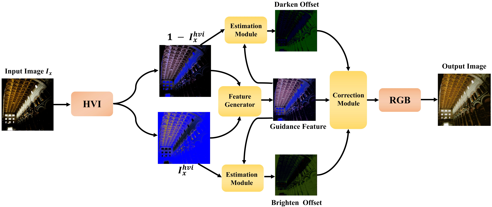

# DSNET
This is the official PyTorch code for our paper 
DSNET: DUAL-STREAMHARMONIZATIONNETWORKFORIMAGEENHANCEMENT




#### 0. Preparation

Create a new conda environment
```
conda env create -f environment.yaml
conda activate ds
```

Download the checkpoints from Anonymous Google drive 

- `./pretrained/best-msec.ckpt` [link](https://drive.google.com/file/d/1zJciH6h8EVqzmf2IsbotTQEMYWEqSyT-/view?usp=drive_link)
- `./pretrained/best-lcdp.ckpt` [link](https://drive.google.com/file/d/1zhaYnvnSdGioT47KF2MfIeLenw0HfQfP/view?usp=drive_link)

#### 1. Test

For testing the example images in `./src`, simply run:

```
CUDA_VISIBLE_DEVICES=0 python test.py checkpoint_path=pretrained/best-lcdp.ckpt
```

#### 2. Train

##### 2.1 Data Preparation
Our model is trained with the [LCDP](https://github.com/onpix/LCDPNet/tree/main) and [MSEC](https://github.com/mahmoudnafifi/Exposure_Correction).


##### 2.2 Train
Parameters can be edited in `config.yaml`, such as batch size (`batch_size`), number of GPUs (`number_of_gpu`), learning rate (`learning_rate`).

On NVIDIA GeForce RTX 3090, setting 6 batches per GPU takes 20GB memory for each GPU. We use 2 GPUs to train the framework.

If you want to train from scratch, please set `opt.checkpoint_path`.

-------

This code is based on [RetouchDiffusion](https://github.com/SuperOptimalZ/RetouchDiffusion.git) and [LCDP](https://github.com/onpix/LCDPNet.git)